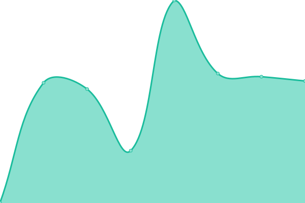

# [📈 Live Status](https://status.bwnsc.in.th): <!--live status--> **🟧 Partial outage**

This repository contains the open-source uptime monitor and status page for [naphatphong-bwnsc](https://status.bwnsc.in.th), powered by [Upptime](https://github.com/upptime/upptime).

With [Upptime](https://upptime.js.org), you can get your own unlimited and free uptime monitor and status page, powered entirely by a GitHub repository. We use [Issues](https://github.com/naphatphong-bwnsc/status/issues) as incident reports, [Actions](https://github.com/naphatphong-bwnsc/status/actions) as uptime monitors, and [Pages](https://status.bwnsc.in.th) for the status page.

<!--start: status pages-->
<!-- This summary is generated by Upptime (https://github.com/upptime/upptime) -->
<!-- Do not edit this manually, your changes will be overwritten -->
<!-- prettier-ignore -->
| URL | Status | History | Response Time | Uptime |
| --- | ------ | ------- | ------------- | ------ |
|  [BWNSC](https://www.bwnsc.in.th/) | 🟥 Down | [bwnsc.yml](https://github.com/naphatphong-bwnsc/status/commits/HEAD/history/bwnsc.yml) | 

 573ms
     
 | 

<a href="https://status.bwnsc.in.th/history/bwnsc">69.52%</a>
    

|  [EMAIL@BWNSC](https://email.bwnsc.in.th/) | 🟩 Up | [email-bwnsc.yml](https://github.com/naphatphong-bwnsc/status/commits/HEAD/history/email-bwnsc.yml) | 

 494ms
     
 | 

<a href="https://status.bwnsc.in.th/history/email-bwnsc">100.00%</a>
    

|  [SOS@BWNSC](https://sos.bwnsc.in.th/) | 🟩 Up | [sos-bwnsc.yml](https://github.com/naphatphong-bwnsc/status/commits/HEAD/history/sos-bwnsc.yml) | 

 417ms
     
 | 

<a href="https://status.bwnsc.in.th/history/sos-bwnsc">99.89%</a>
    

|  [ระบบเช็กชื่อสภานักเรียนโรงเรียนบุญวัฒนา](https://bwnsc2024.lnw.mn/Check/) | 🟩 Up | [.yml](https://github.com/naphatphong-bwnsc/status/commits/HEAD/history/.yml) | 

 1526ms
     
 | 

<a href="https://status.bwnsc.in.th/history/">69.41%</a>
    

<!--end: status pages-->

[**Visit our status website →**](https://status.bwnsc.in.th)

## 📄 License

- Powered by: [Upptime](https://github.com/upptime/upptime)
- Code: [MIT](./LICENSE) © [Anand Chowdhary](https://anandchowdhary.com), supported by [Pabio](https://pabio.com)
- Data in the `./history` directory: [Open Database License](https://opendatacommons.org/licenses/odbl/1-0/)
